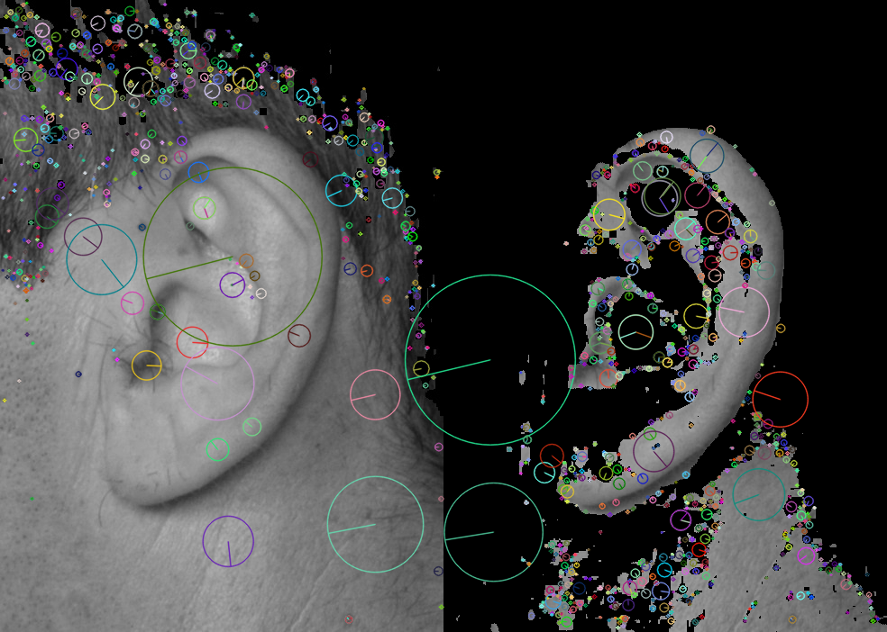
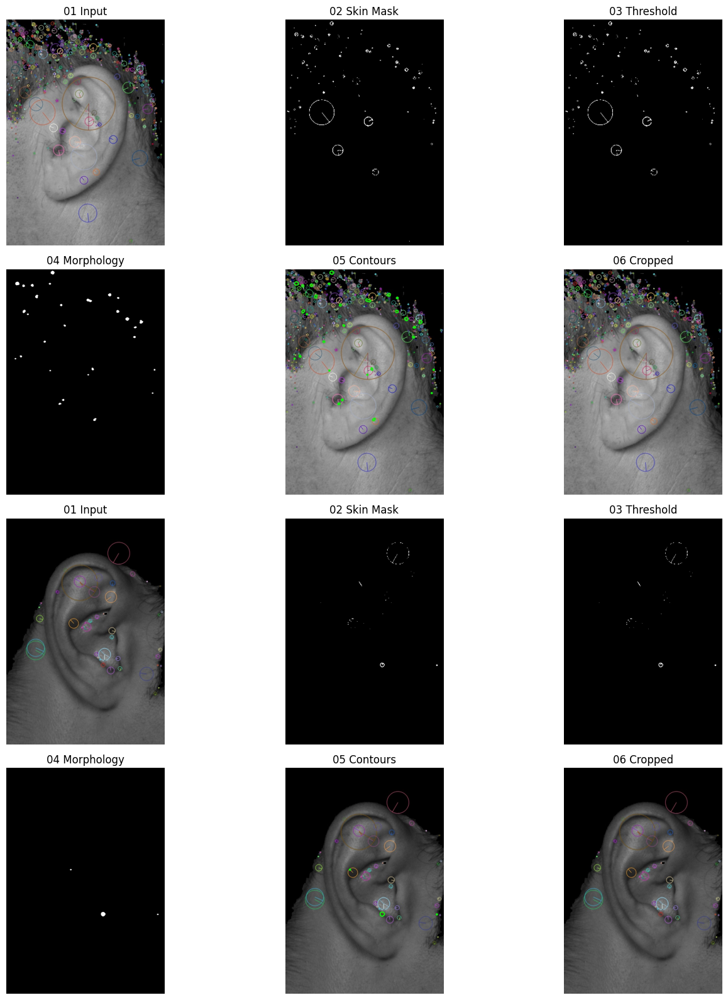

# 🎧 Ear Biometrics Detection & Recognition

A biometric authentication system that identifies and verifies individuals using unique ear characteristics. This project combines **Computer Vision, Feature Engineering, Machine Learning, and Deep Learning** techniques to perform secure ear-based recognition and authentication.


---

# 📖 Overview

Biometric authentication systems use unique physiological traits to verify identities. While fingerprints, iris recognition, and facial recognition are commonly used, the human ear is also a highly distinctive biometric characteristic.

Unlike facial expressions, the structure of the ear remains relatively stable throughout life and is less affected by facial hair, makeup, or emotions. This makes ear biometrics a promising alternative for identity verification.

This project implements a complete Ear Biometrics Authentication Pipeline capable of:

- Detecting and localizing ears from images
- Segmenting skin regions
- Removing noise and background information
- Extracting robust SIFT features
- Matching ear structures
- Classifying identities using KNN and CNN
- Authenticating users through decision fusion

---

# 🚀 Features

- Ear Image Preprocessing
- Skin Detection using YCbCr Color Space
- Otsu Thresholding
- Morphological Operations
- Contour-Based Ear Localization
- SIFT Feature Extraction
- SIFT Feature Matching
- KNN Classification
- CNN Classification
- Multi-Stage Authentication
- Visualization of Intermediate Processing Steps

---

# 🛠️ Tech Stack

| Technology | Purpose |
|------------|----------|
| Python | Core Development |
| OpenCV | Computer Vision & SIFT |
| NumPy | Numerical Computation |
| TensorFlow/Keras | Deep Learning |
| Scikit-Learn | Machine Learning |
| Matplotlib | Visualization |
| Jupyter Notebook | Experimentation |

---

# 🧠 Technologies & Algorithms Explained

This project combines traditional Computer Vision techniques with Machine Learning and Deep Learning to build a complete biometric authentication system.

---

## OpenCV

OpenCV is the primary Computer Vision library used throughout the project.

### Why OpenCV?

OpenCV provides optimized implementations for:

- Image Processing
- Color Space Conversion
- Thresholding
- Morphological Operations
- Contour Detection
- SIFT Feature Extraction

### Used Functions

```python
cv2.cvtColor()
cv2.threshold()
cv2.findContours()
cv2.morphologyEx()
cv2.SIFT_create()
```

### Role in Project

- Ear Localization
- Image Preprocessing
- Feature Extraction

---

## NumPy

NumPy is used for numerical computations and image matrix operations.

### Role in Project

- Pixel Manipulation
- Threshold Calculations
- Feature Vector Generation
- Dataset Handling

---

## TensorFlow / Keras

TensorFlow is used to build and train the Convolutional Neural Network.

### Role in Project

- Feature Learning
- Identity Classification
- Deep Learning Inference

---

## Scikit-Learn

Scikit-Learn provides traditional Machine Learning algorithms.

### Role in Project

- KNN Classification
- Data Preprocessing
- Performance Evaluation

---

## Matplotlib

Used for visualization and result analysis.

### Role in Project

- Displaying Processing Stages
- Result Visualization
- Data Analysis

---

# 📂 Dataset

The dataset contains ear images collected from multiple individuals under different orientations.

## Dataset Statistics

| Metric | Value |
|----------|----------|
| Individuals | 25 |
| Images | ~175 |
| Images Per Person | 7 |
| Image Format | JPG |

---

## Pose Variations

Each subject contains images captured from multiple viewpoints.

- Front
- Back
- Left
- Right
- Up
- Down
- Zoom

### Example

```text
012_front_ear.jpg
012_back_ear.jpg
012_down_ear.jpg
```

---

# 🔍 Image Preprocessing Pipeline

Raw images often contain:

- Background objects
- Lighting variations
- Noise
- Irrelevant information

Before feature extraction, preprocessing is performed to isolate the ear region.

---

## 1️⃣ YCbCr Color Space Conversion

The first step converts the image from BGR to YCbCr.

### Why YCbCr?

YCbCr separates brightness information from color information.

| Component | Meaning |
|------------|----------|
| Y | Luminance |
| Cb | Blue Chrominance |
| Cr | Red Chrominance |

Human skin occupies a predictable range in the Cb-Cr space, making skin segmentation easier.

### Skin Detection Thresholds

```python
MIN_YCRCB = [0,154,77]
MAX_YCRCB = [255,183,140]
```

### Benefits

- Better skin segmentation
- Improved ear localization
- Reduced background noise

---

## 2️⃣ Otsu Thresholding

Otsu's method automatically finds the optimal threshold value.

### Purpose

- Convert grayscale images into binary images
- Separate foreground from background
- Improve contour extraction

### Workflow

```text
Grayscale Image
       ↓
Otsu Threshold
       ↓
Binary Image
```

---

## 3️⃣ Morphological Operations

Morphological operations improve segmentation quality.

### Closing

```text
Dilation → Erosion
```

Used to:

- Fill holes
- Connect fragmented regions

### Opening

```text
Erosion → Dilation
```

Used to:

- Remove noise
- Smooth object boundaries

### Benefits

- Cleaner masks
- Better contour extraction
- Improved localization

---

## 4️⃣ Contour Detection & Ear Localization

After segmentation:

1. Detect contours
2. Find largest contour
3. Generate bounding rectangle
4. Crop ear region

### Why?

This removes irrelevant regions and focuses only on the ear.

---

# 📸 Results & Visual Demonstration

## Skin Detection using YCbCr

The image below demonstrates skin segmentation using predefined YCbCr thresholds.

<p align="center">
  
</p>

### Purpose

- Skin Segmentation
- Background Removal
- Ear Isolation

---

## Complete Preprocessing Pipeline

The image below demonstrates the complete preprocessing workflow.

### Stages

1. Input Image
2. Skin Mask
3. Thresholding
4. Morphological Operations
5. Contour Detection
6. Ear Cropping

<p align="center">
  
</p>

### Purpose of Each Stage

| Stage | Purpose |
|---------|----------|
| Input | Original Ear Image |
| Skin Mask | Extract Skin Region |
| Threshold | Binary Segmentation |
| Morphology | Noise Removal |
| Contours | Ear Boundary Detection |
| Cropped | Final Region of Interest |

---

# 🎯 Feature Extraction using SIFT

The core feature extraction technique used in this project is **SIFT (Scale-Invariant Feature Transform)**.

SIFT extracts highly distinctive local features from ear structures.

---

## Why SIFT?

Ear images may:

- Be rotated
- Be scaled
- Have different illumination
- Be captured from slightly different viewpoints

SIFT remains robust under these conditions.

### Advantages

- Scale Invariant
- Rotation Invariant
- Illumination Robust
- Noise Resistant

---

## How SIFT Works

### 1. Scale Space Construction

Multiple blurred versions of the image are generated using Gaussian filters.

Purpose:

- Detect features at multiple scales

---

### 2. Difference of Gaussian (DoG)

Adjacent Gaussian images are subtracted.

Purpose:

- Detect potential keypoints

---

### 3. Keypoint Localization

Weak and unstable points are removed.

Purpose:

- Improve matching reliability

---

### 4. Orientation Assignment

Each keypoint receives a dominant orientation.

Purpose:

- Achieve rotation invariance

---

### 5. Descriptor Generation

For every keypoint SIFT generates a:

```text
128-Dimensional Descriptor
```

This descriptor acts as a fingerprint for that local region.

---

## SIFT in this Project

Example:

```text
Reference Ear:
119 Keypoints

Probe Ear:
101 Keypoints
```

These descriptors are later matched during authentication.

---

# 🔗 Feature Matching

After extracting descriptors, feature matching is performed.

---

## Brute Force Matcher (BFMatcher)

BFMatcher compares every descriptor from the probe image with every descriptor from the reference image.

### Purpose

- Identify similar feature points
- Determine structural similarity

---

## Lowe's Ratio Test

Not every SIFT match is reliable.

A match is accepted if:

```text
d1 < 0.75 × d2
```

Where:

- d1 = nearest descriptor distance
- d2 = second nearest descriptor distance

### Benefits

- Removes false matches
- Improves matching accuracy
- Reduces ambiguity

---

# 🤖 Machine Learning Model

## K-Nearest Neighbors (KNN)

KNN is a traditional Machine Learning algorithm used for identity classification.

### Workflow

```text
Image
  ↓
Resize
  ↓
Flatten
  ↓
Feature Scaling
  ↓
KNN Classifier
```

### Configuration

```python
K = 3
```

### Distance Metric

Euclidean Distance

### Advantages

- Simple
- Fast
- Easy to interpret
- Works well on small datasets

---

# 🧠 Deep Learning Model

## Convolutional Neural Network (CNN)

CNN automatically learns hierarchical ear features directly from images.

---

## Why CNN?

Instead of manually designing features, CNN learns them automatically.

### Feature Learning Hierarchy

Layer 1:

- Edges
- Curves

Layer 2:

- Shapes
- Textures

Layer 3:

- Ear Structures

Final Layers:

- Identity-Specific Features

---

## CNN Architecture

```text
Input (96×96×1)
       ↓
Conv2D (32 Filters)
       ↓
MaxPooling
       ↓
Conv2D (64 Filters)
       ↓
MaxPooling
       ↓
Conv2D (128 Filters)
       ↓
MaxPooling
       ↓
Flatten
       ↓
Dense (128)
       ↓
Dropout (0.4)
       ↓
Softmax Output Layer
```

---

## Activation Function

```python
ReLU
```

Introduces non-linearity and improves learning.

---

## Optimizer

```python
Adam
```

Provides adaptive learning rates.

---

## Loss Function

```python
Sparse Categorical Crossentropy
```

Used for multi-class classification.

---

## Training Parameters

```python
Epochs = 20
Batch Size = 16
Validation Split = 20%
```

---


# 📸 Results & Visual Demonstration

## Skin Detection using YCbCr

<p align="center">
  
</p>

The image above shows how YCbCr thresholding isolates skin regions, helping remove background information before feature extraction.

---

## Complete Preprocessing Pipeline

<p align="center">
  
</p>

The output above demonstrates the complete preprocessing pipeline:

1. Original Ear Image
2. Skin Detection Mask
3. Binary Thresholding
4. Morphological Processing
5. Contour Detection
6. Final Cropped Ear Region

This preprocessing pipeline significantly improves the quality of features extracted by SIFT and enhances classification performance.

# 📊 Results

## Authentication Example

| Metric | Value |
|----------|----------|
| Claimed ID | 012 |
| Good Matches | 5 |
| Reference Keypoints | 119 |
| Probe Keypoints | 101 |
| KNN Prediction | 012 |
| CNN Prediction | 012 |
| Final Result | ✅ ACCEPTED |

---

## CNN Performance

| Metric | Value |
|----------|----------|
| Individuals | 25 |
| Images | 175 |
| Epochs | 20 |
| Accuracy | 3.77% |

### Why Accuracy is Low

- Small Dataset
- Limited Images per Class
- No Data Augmentation
- Large Number of Classes

---

# ⚙️ Installation

## Clone Repository

```bash
git clone https://github.com/yourusername/Ear-Biometrics-Detection.git

cd Ear-Biometrics-Detection
```

## Install Dependencies

```bash
pip install -r requirements.txt
```

---

# ▶️ Usage

## Train Both Models

```bash
python ear_classification.py --model both --epochs 20
```

## Train CNN

```bash
python ear_classification.py --model cnn
```

## Train KNN

```bash
python ear_classification.py --model knn
```

## Authenticate User

```bash
python ear_classification.py \
--authenticate \
--claim-id 012 \
--probe-image "ALL PICS/012_back_ear.jpg"
```

---

# 📁 Project Structure

```text
Ear-Biometrics-Detection
│
├── ear_classification.py
├── ear_classification.ipynb
├── Basicear.ipynb
├── requirements.txt
│
├── database/
│   ├── skindetection.png
│   ├── output.png
│   └── Dataset Images
│
├── ALL PICS/
│   └── Processed Images
│
├── saved_models/
│   ├── ear_cnn.keras
│   ├── ear_cnn_labels.npy
│   └── ear_cnn_results.json
│
└── README.md
```

---

# 🔮 Future Improvements

- Data Augmentation
- Transfer Learning
- Real-Time Authentication
- Mobile Deployment
- REST API Development
- Larger Dataset Collection
- Multi-Biometric Fusion
- CNN Hyperparameter Optimization

---

# 🎓 Key Concepts Demonstrated

This project demonstrates:

- Digital Image Processing
- Computer Vision
- Feature Extraction
- Pattern Recognition
- Machine Learning
- Deep Learning
- Image Segmentation
- Object Localization
- Feature Matching
- Biometric Authentication

---

# 👩‍💻 Author

**Devanshi Das**

Electronics & Communication Engineering Student

### Areas of Interest

- Artificial Intelligence
- Machine Learning
- Computer Vision
- Biometrics
- Deep Learning
- Intelligent Systems

---

## ⭐ If you found this project useful, consider giving it a star!
